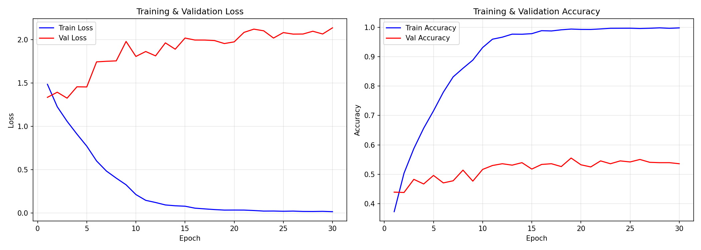
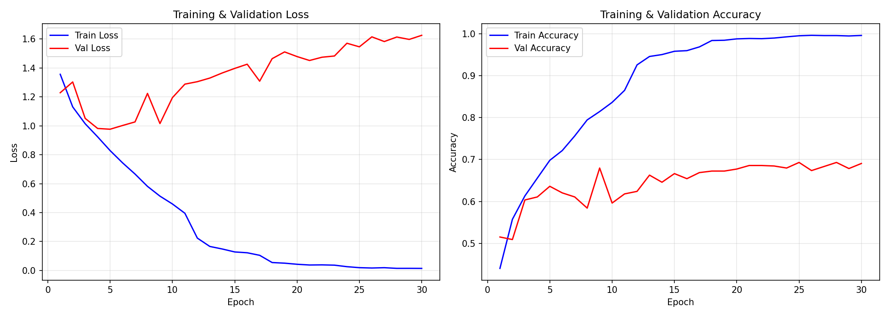

# Матурски рад

## Тема

Примена вештачке интелигенције за препознавање емоција у реалном времену помоћу камере: поређење ефикасности динамичких и статичких података при учењу

---

## Предговор

Тема аутоматског препознавања емоција делује једноставно само на нивоу идеје. У пракси је то спој неколико сложених области: психологије, рачунарског вида, инжењеринга података и оптимизације модела за рад у реалном времену. Ако систем греши, то скоро никада није „једна грешка на једном месту“. Најчешће је у питању ланац фактора: квалитет података, неодређеност мимике, преобучавање и ограничења рачунарских ресурса.

Управо зато је у овом раду нагласак стављен не само на „који модел је дао већи проценат“, већ и на научну коректност поређења. Обе гране експеримента (static и dynamic) формирају се из истог видео-датасета, са истом логиком поделе на train/val/test. Такав дизајн омогућава да се ефекат временског контекста разматра суштински, а не да се закључци замене разликом између датасетова.

Рад спаја теоријски преглед и примењени резултат: изграђен је репродуцибилан pipeline за припрему података, тренирање и евалуацију модела, као и радни режим инференције са камере у реалном времену.

---

## 1. Увод

Емоционално стање човека директно утиче на комуникацију, доношење одлука и квалитет интеракције са дигиталним сервисима. Зато задатак аутоматског препознавања емоција по лицу остаје актуелан и за примењени инжењеринг и за истраживачку агенду у области рачунарског вида [9], [12]. У пракси се такви системи разматрају за образовне платформе, интерфејсе човек–машина, праћење стања и анализу корисничког искуства.

Проблем је у томе што су многа решења обучена на статичким сликама, док се емоција у реалној комуникацији испољава као процес кроз време. Појединачни кадар може бити неодређен: на пример, рана фаза изненађења визуелно је блиска другим стањима. Видео-секвенца потенцијално омогућава да се прецизније ухвати динамика мимике, али захтева више рачунарских ресурса и сложенију архитектуру модела.

Циљ овог рада је да истражи примену ВИ за препознавање емоција у реалном времену помоћу камере и да упореди ефикасност два приступа: статичког (single frame) и динамичког (frame sequence). Објекат истраживања је аутоматско препознавање емоција по изразу лица. Предмет истраживања је утицај типа улазних података на квалитет класификације и перформансе система. Радна хипотеза гласи да ће уважавање временског контекста побољшати тачност препознавања, али смањити FPS.

За проверу хипотезе урађени су следећи кораци: спроведен је преглед теоријске основе из AI/CV и FER (Facial Expression Recognition - препознавање емоција по изразу лица); реализована су два упоредива модела (ResNet-18 и ResNet-18+LSTM); припремљени су static и dynamic скупови из јединственог извора видео-података; извршено је тренирање по јединственом протоколу са накнадном евалуацијом на test скупу; спроведена је критичка анализа резултата уз уважавање ограничења, претњи валидности и практичне применљивости у режиму реалног времена.

Практични значај истраживања одређен је репродуцибилним поређењем два приступа на истим полазним подацима. Такав формат омогућава да се не расправља о апстрактно „најбољем алгоритму“, већ о конкретном и проверљивом балансу квалитета препознавања и брзине рада.

---

## 2. Теоријске основе

### 2.1 Вештачка интелигенција и машинско учење

Вештачка интелигенција у контексту овог рада посматра се као скуп метода који омогућавају аутоматско издвајање обележја из визуелних података и класификацију стања човека [1], [2].

Савремени квалитет у задацима слика и видеа обезбедиле су методе дубоког учења [3], [4]. За слике су стандард постале CNN архитектуре, где се обележја издвајају хијерархијски: од једноставних ивица ка сложенијим обрасцима [4], [6], [7]. За секвенцијалне податке користе се рекурентни механизми, посебно LSTM, који могу да уважавају зависности између суседних временских корака [8].

За обуку оваквих модела обично је потребна значајна количина означених података: дубоке мреже имају велику „капацитивност“ и на малим скуповима брзо се прилагођавају специфичностима train скупа. Зато се практичан рад у FER-у скоро увек ослања на датасете у којима је сваком фрагменту додељена ознака емоције. У овом раду користи се Urdu-Multimodal-Emotion-Dataset: он садржи видео-клипове са емоционалним ознакама на нивоу клипа, што омогућава да се и static улаз (један кадар) и dynamic улаз (кратак временски прозор кадрова) формирају из истог извора. Детаљи састава и поделе скупа наведени су у методолошком делу.

У експерименталном делу рад се ослања на supervised classification: модел добија улаз (слику или секвенцу кадрова) и треба да предвиди једну од унапред дефинисаних класа емоција. У пракси квалитет таквог решења не зависи само од архитектуре, већ и од тога колико модел генерализује на нова лица, осветљење и контекст, односно од односа између „учења детаља train скупа“ и стабилности на val/test. Зато је при поређењу static и dynamic приступа важно фиксирати јединствен протокол поделе и исте метрике: иначе разлика у процентима може одражавати не својства приступа, већ специфичности узорка.

Посебно треба нагласити улогу transfer learning-а. Коришћење унапред обучених CNN екстрактора обично омогућава брже добијање разумних обележја, нарочито ако је циљни датасет ограничен или има шум у ознакама. У том режиму модел не „учи од нуле да види лице“, већ прилагођава већ формиране универзалне визуелне филтере задацима FER-а.

Из практичне перспективе, модели за препознавање емоција се користе као компонента ширих система: у HCI (адаптивни интерфејси), у образовним апликацијама (процена ангажованости), у анализи реакција на садржај, као и у задацима мониторинга стања (нпр. индикације умора). При томе исправност примене зависи од домена, квалитета података и граница интерпретације: модел класификује визуелни образац, а не „мери“ унутрашње стање човека.

### 2.2 Рачунарски вид као примењени темељ

Рачунарски вид решава задатак интерпретације визуелних информација: од детекције лица до класификације емоције [5]. У практичном FER pipeline-у обично се издвајају фазе:

1. Детекција лица.
2. Претобрада (кадрирање, нормализација, усклађивање димензија).
3. Издвајање обележја.
4. Класификација.

Прелаз са ручно дефинисаних обележја на end-to-end обучиве моделе био је кључни фактор раста квалитета [6], [7], [12].

За препознавање емоција је критична исправна локализација области интересовања (ROI), јер се већина корисних информација налази у области лица, док позадина уноси шум. У практичним real-time системима детекција лица и робусност на окретање главе, осветљење и делимична преклапања не представљају „детаљ имплементације“, већ фактор који директно утиче на расподелу грешака модела.

Такође је важно разликовати два задатка: (1) добити стабилан и упоредив улаз (кадрирање, скалирање, нормализација), и (2) обучити класификатор да разликује емоције. Ако је први корак нестабилан, чак и јак модел може давати „скачуће“ предикције, посебно у динамичком режиму где се грешка ROI може акумулирати кроз кадрове.

### 2.3 Препознавање емоција: психолошки и рачунарски оквир

Класични оријентир за категоријално препознавање емоција јесте приступ Пола Екмана и FACS [10], [11]. У примењеним системима користи се ограничен скуп класа, допуњен класом neutral. У текућем експерименту, према датасету, издвојено је пет класа: anger, happy, love, neutral, sad.

Важно је истаћи да препознавање емоција по лицу није „директно мерење унутрашњег стања“. То је статистичка процена на основу визуелних обележја, па коректна интерпретација резултата мора да уважава ограничења података и контекста [12].

Из тога следи кључан методолошки закључак: метрике Accuracy/F1 одражавају квалитет препознавања ознака у датасету, али не гарантују тачност психолошке интерпретације емоција као доживљаја. На нивоу података постоје двосмислени изрази, индивидуалне разлике у мимици и културне особености исказивања емоција. Зато је у истраживачком делу важно анализирати не само „колико процената је добијено“, већ и профил грешака (confusion matrix): које емоције се најчешће мешају и зашто до тога може долазити.

У контексту овог рада битно је и ограничење скупа класа. Прелаз са вишедимензионалних модела афекта на мали скуп категорија поједностављује задатак за класификатор и чини поређење static/dynamic приступа транспарентнијим, али истовремено „сабија“ реалну сложеност емоција у дискретне ознаке.

### 2.4 Статички и динамички подаци: принципијелна разлика

Статички приступ:

- улаз: једна слика;
- предност: велика брзина, једноставнија инфраструктура;
- мана: нема временског контекста.

Динамички приступ:

- улаз: секвенца кадрова;
- предност: модел види развој мимике кроз време;
- мана: већа рачунарска цена и сложенији pipeline.

Резултати FER прегледа показују да temporal modeling често додаје на квалитету, нарочито код сложених емоционалних прелаза [12]. Али у системима са строгим захтевом за FPS статички приступ остаје конкурентан.

Из инжењерске перспективе, динамички режим значи рад не са једним кадром, већ са бафером: да би се формирао прозор од више кадрова, систему је потребно или да сачека акумулацију прозора (што додаје кашњење), или да примени клизни прозор и освежава предикцију како пристижу нови кадрови. То усложњава pipeline, јер се претобрада извршава за сваки кадар, а детекција лица може имати пропусте и помераје; као последица, коначна класификација постаје осетљива на стабилност ROI кроз време. Зато је избор дужине прозора и учесталости освежавања архитектонска одлука која утиче и на тачност и на доживљену „глаткоћу“ рада. У оквиру овог рада динамички улаз је дефинисан као кратак прозор од 16 кадрова, како би се задржао временски контекст без претераног раста кашњења.

Управо на тој раскрсници се гради логика експеримента: проверити у којој мери додавање временског контекста кроз кратку секвенцу кадрова побољшава квалитет генерализације и која је експлоатациона цена тог побољшања у режиму рада у реалном времену. Важно је да овај компромис није „једном заувек исправан“: он зависи од циљног уређаја, дозвољеног кашњења и тога шта је у конкретном сценарију важније — максимална тачност или флуидност и стабилност рада.

---

## 3. Методологија истраживања

### 3.1 Подаци и протокол експеримента

Да би поређење било коректно, обе гране (static/dynamic) изграђене су на једном извору видеа. Разликује се само начин представљања улаза:

- static: централни кадар клипа;
- dynamic: секвенца од 16 кадрова, равномерно одабраних по клипу.

Такав дизајн минимизује утицај скривених фактора и омогућава да се разлика у метрикама приписује управо уважавању времена.

Извор: Urdu-Multimodal-Emotion-Dataset [13] (коришћен визуелни модалитет).

Ради недвосмислене репродуцибилности: у train.csv сваки ред описује један видео-клип и садржи најмање идентификатор/путању до фајла и ознаку емоције (класу). Датотека splits.txt дефинише којем подскупу (train/val/test) припада сваки клип. Даље се у pipeline-у train.csv користи као главни регистар примера и ознака, а splits.txt као фиксни протокол поделе без случајног поновног раздвајања током обуке.

Укупан обим: 8283 видео-фрагмента.

Расподела класа у изворном скупу:

- Anger: 2070
- Happy: 1774
- Neutral: 1673
- Sad: 1630
- Love: 1136

Подела (стратификована) из датотеке splits.txt:

- train: 6625
- val: 827
- test: 831

Стратификација по класама је испоштована (пример):

- test: Anger 207, Happy 178, Love 115, Neutral 168, Sad 163.

Основни кораци:

1. Читање train.csv и валидација присуства видео-датотека.
2. Нормализација ознака и формирање label_map.
3. Детекција лица (OpenCV Haar Cascade).
4. Кадрирање и resize на 224x224.
5. Формирање static и dynamic подскупова.

Важан инжењерски детаљ: када детекција лица изостане, користи се fallback у виду resize целог кадра. То повећава робусност pipeline-а, али истовремено уноси потенцијални шум у обележја.

Испод је фрагмент из кодне базе (претобрада и формирање улаза) који показује два принципијелно важна момента за коректно поређење: (1) детекцију лица са fallback-ом на цео кадар, (2) равномерни избор индекса кадрова за динамички прозор.

```python
def detect_and_crop_face(image, face_cascade):
	"""Detect and crop largest face; fallback to resized full frame."""
	gray = cv2.cvtColor(image, cv2.COLOR_BGR2GRAY) if len(image.shape) == 3 else image
	faces = face_cascade.detectMultiScale(
		gray, scaleFactor=1.1, minNeighbors=5, minSize=(MIN_FACE_SIZE, MIN_FACE_SIZE)
	)

	if len(faces) == 0:
		return cv2.resize(image, (IMG_SIZE, IMG_SIZE))

	x, y, w, h = max(faces, key=lambda f: f[2] * f[3])
	margin = int(0.1 * max(w, h))

	x1 = max(0, x - margin)
	y1 = max(0, y - margin)
	x2 = min(image.shape[1], x + w + margin)
	y2 = min(image.shape[0], y + h + margin)

	face = image[y1:y2, x1:x2]
	return cv2.resize(face, (IMG_SIZE, IMG_SIZE))


def sample_frame_indices(frame_count, seq_len):
	"""Generate seq_len indices uniformly across a clip."""
	if frame_count <= 0:
		return []
	if frame_count == 1:
		return [0] * seq_len
	points = np.linspace(0, frame_count - 1, num=seq_len)
	return [int(round(p)) for p in points]
```

### 3.2 Модели, обука и метрике

Static-модел: ResNet-18 са заменом последњег класификатора на број класа.

Dynamic-модел: ResNet-18 (feature extractor без FC) + LSTM + класификатор.

Оваква конструкција обезбеђује упоредивост: просторни екстрактор обележја у обе гране је концептуално исти, разликује се само уважавање времена.

Испод је фрагмент реализације архитектура (static ResNet-18 и dynamic ResNet-18+LSTM).

```python
class StaticEmotionModel(nn.Module):
	def __init__(self, num_classes=7, pretrained=True):
		super().__init__()
		weights = models.ResNet18_Weights.DEFAULT if pretrained else None
		self.resnet = models.resnet18(weights=weights)
		in_features = self.resnet.fc.in_features
		self.resnet.fc = nn.Linear(in_features, num_classes)

	def forward(self, x):
		return self.resnet(x)


class DynamicEmotionModel(nn.Module):
	def __init__(self, num_classes=7, hidden_size=LSTM_HIDDEN_SIZE, num_layers=LSTM_NUM_LAYERS, pretrained=True):
		super().__init__()
		weights = models.ResNet18_Weights.DEFAULT if pretrained else None
		resnet = models.resnet18(weights=weights)
		self.feature_extractor = nn.Sequential(*list(resnet.children())[:-1])

		self.lstm = nn.LSTM(
			input_size=RESNET_FEATURE_DIM,
			hidden_size=hidden_size,
			num_layers=num_layers,
			batch_first=True,
			dropout=0.2 if num_layers > 1 else 0.0,
		)
		self.fc = nn.Sequential(nn.Dropout(0.3), nn.Linear(hidden_size, num_classes))

	def forward(self, x):
		batch_size, seq_len, C, H, W = x.shape
		x = x.view(batch_size * seq_len, C, H, W)
		features = self.feature_extractor(x).view(batch_size, seq_len, -1)
		lstm_out, _ = self.lstm(features)
		logits = self.fc(lstm_out[:, -1, :])
		return logits
```

У експерименту се вредност `num_classes` одређује на основу `label_map.json`, формираног у `prepare_data.py`, и прослеђује се при креирању модела; вредност `7` у потписима је само подразумевана.

Основни параметри (baseline):

- optimizer: Adam;
- loss: CrossEntropyLoss;
- epochs: до 50;
- batch: 32 (static), 8 (dynamic).

Финална optimized-конфигурација у поређењу:

- lr=1e-4;
- label_smoothing=0.05;
- early_stopping_patience=10;
- избор финалног checkpoint-а по најбољем val_acc.

Процедура обуке била је логички иста за обе гране. У свакој епохи модел је пролазио кроз батчеве за обуку, извршавали су се директни пролаз, рачунање функције губитка, backpropagation и ажурирање тежина оптимизатором Adam. По завршетку епохе покретана је валидација без ажурирања тежина, како би се измерила способност генерализације на подацима који нису учествовали у обуци.

У optimized сценарију коришћен је scheduler ReduceLROnPlateau: ако val_loss престане да се побољшава, learning rate се смањује 2 пута. То је стабилизовало касне фазе обуке. Додатно је примењено рано заустављање: ако нема побољшања на validation у задатом броју епоха, обука се прекида. Овај механизам смањује ризик прекомерног прилагођавања train скупу.

Посебно је фиксирана логика избора финалног модела. За завршно поређење коришћен је checkpoint best-by-acc (максимум val_acc), а не последњи checkpoint обуке. Ово је важно, јер последње епохе не дају увек најбољи баланс између train и validation.

Ради транспарентности експеримента чуване су историје train_loss, train_acc, val_loss и val_acc, као и графици кривих обуке. То је омогућило не само поређење коначних бројева на test скупу, већ и тумачење понашања модела током целог процеса обуке.

Испод је фрагмент optimized-обуке који приказује кључне елементе controlled optimization: ReduceLROnPlateau, рано заустављање и чување checkpoint-а по најбољем val_acc.

```python
criterion = nn.CrossEntropyLoss(label_smoothing=args.label_smoothing)
optimizer = torch.optim.Adam(model.parameters(), lr=args.lr, weight_decay=args.weight_decay)
scheduler = torch.optim.lr_scheduler.ReduceLROnPlateau(optimizer, mode="min", factor=0.5, patience=3)

best_val_loss = float("inf")
best_val_acc_ckpt = -1.0
no_improve_epochs = 0

for epoch in range(1, args.epochs + 1):
	train_loss, train_acc = train_one_epoch(
		model, train_loader, criterion, optimizer, DEVICE, amp_enabled, scaler
	)
	val_loss, val_acc = validate(model, val_loader, criterion, DEVICE, amp_enabled)
	scheduler.step(val_loss)

	improved_loss = val_loss < (best_val_loss - args.min_delta)
	improved_acc = val_acc > best_val_acc_ckpt

	if improved_acc:
		best_val_acc_ckpt = val_acc
		checkpoint_path = CHECKPOINTS_DIR / f"best_{model_type}_opt.pth"
		torch.save(
			{
				"epoch": epoch,
				"model_state_dict": model.state_dict(),
				"optimizer_state_dict": optimizer.state_dict(),
				"val_acc": val_acc,
				"val_loss": val_loss,
				"label_smoothing": args.label_smoothing,
				"weight_decay": args.weight_decay,
				"lr": args.lr,
			},
			checkpoint_path,
		)

	if improved_loss:
		best_val_loss = val_loss
		no_improve_epochs = 0
	else:
		no_improve_epochs += 1

	if no_improve_epochs >= args.early_stopping_patience:
		break
```

Метрике коришћене у евалуацији:

- Accuracy;
- Precision (macro);
- Recall (macro);
- F1-score (macro);
- confusion matrix;
- FPS (пропусна моћ модела при инференцији на тест батчевима, измерена у `experiment/evaluate.py`).

Дефиниције:

$$
Accuracy = \frac{\text{број тачних предвиђања}}{\text{укупан број предвиђања}}
$$

$$
Precision_{macro} = \frac{1}{K}\sum_{k=1}^{K} Precision_k,\quad
Recall_{macro} = \frac{1}{K}\sum_{k=1}^{K} Recall_k,\quad
F1_{macro} = \frac{1}{K}\sum_{k=1}^{K} F1_k
$$

где је $K$ број класа емоција.

За контролу преобучавања коришћен је generalization gap:

$$
Gap = Accuracy_{train} - Accuracy_{val}
$$

---

## 4. Реализација система у реалном времену

### 4.1 Реализација pipeline-а и компромиси real-time режима

Развијени систем препознавања емоција ради изнад видео-тока са веб-камере и конципиран је као секвенцијални конвејер, где свака фаза предаје резултат следећој. На нивоу имплементације то је континуална петља читања кадрова и извршавања детекције, претобраде и инференције за сваки кадар (или део кадрова у оптимизованој варијанти).

Основни радни циклус система:

1. Захват наредног кадра са камере (`cv2.VideoCapture`).
2. Детекција лица на кадру.
3. Издвајање ROI (region of interest) по лицу и претобрада слике.
4. Инференција модела (static или dynamic) и добијање вероватноћа класа.
5. Визуелизација резултата преко изворног кадра (рам, натпис класе, процена поузданости).
6. Израчунавање текућег FPS и приказ сервисних информација.

Са инжењерске тачке гледишта, кључно је да квалитет и стабилност резултата у real-time режиму не зависе само од неуронске мреже, већ и од стабилности детектора лица, исправности трансформације улаза (укључујући нормализацију) и укупне латенције конвејера.

За детекцију лица користи се класични Haar cascade из OpenCV-а (`haarcascade_frontalface_default.xml`). Детекција се ради над сликом у нијансама сиве са параметрима: `scaleFactor=1.1`, `minNeighbors=5`, `minSize=(64, 64)`. Ови параметри задају компромис између осетљивости детектора и броја лажних детекција.

Након проналаска правоугаоника лица додаје се мали margin од 10% максималне странице правоугаоника. То је урађено да би ROI обухватио и граничне делове (на пример, линију вилице или део чела) који могу носити корисне мимичке сигнале.

У базном real-time скрипту обрада се извршава за свако детектовано лице у кадру (итерација по `faces`), дакле систем подржава сценарио са више лица. За свако лице независно се ради припрема улаза и инференција, а потом се цртају рам и натпис.

У оптимизованом скрипту користи се другачији режим: од свих детектованих правоугаоника бира се највећи (по правилу лице најближе камери). То смањује рачунарско оптерећење и чини понашање интерфејса предвидљивијим у свакодневном сценарију.

За real-time режим важне су не само метрике тачности, већ и кашњење обраде кадра (latency), као и стабилност предвиђања између суседних кадрова. У овом раду разматрају се две поставке инференције: статичка и динамичка, а њихова разлика почиње већ на нивоу улазних података.

Статички режим (single frame) обрађује сваки кадар независно. После детекције лица, ROI се преводи из BGR у RGB, затим се примењује трансформација која је усклађена са обуком: resize на улазну димензију и нормализација по ImageNet mean/std (`mean=[0.485, 0.456, 0.406]`, `std=[0.229, 0.224, 0.225]`). Потом се формира батч величине 1 (`unsqueeze(0)`) и покреће директан пролаз модела.

Динамички режим (frame sequence) формира секвенцу кадрова фиксне дужине. У базном скрипту користи се дужина `SEQUENCE_LENGTH=16`, а у оптимизованој варијанти подразумевано се користи краћи прозор (`--seq-len 8`), што смањује рачунарски трошак. Важан део реализације је вођење бафера последњих кадрова лица: сваки нови кадар се додаје у бафер, а при преливању најстарији се уклања. На почетку, док је бафер још кратак, секвенца се допуњује копијама првог доступног кадра до потребне дужине. Тако се обезбеђује исправан облик улаза модела већ у првим секундама рада, иако предвиђања у старту могу бити мање стабилна због вештачког padding-а.

У оба режима модел враћа логите, који се softmax функцијом претварају у вероватноће. Коначна емоција бира се као класа са највећом вероватноћом, а „поузданост“ се приказује у процентима. У интерфејсу је усвојен једноставан визуелни сигнал: зелени рам ако је поузданост изнад 0.5 и наранџасти ако је мања. Та граница служи само за визуелно разликовање ситуација веће и мање поузданости и не тумачи се као строг статистички праг.

Разлика између static и dynamic режима испољава се као класичан компромис: динамички режим, пошто користи више информација, чешће даје квалитетније препознавање, али прави мање предвиђања у секунди. За корисника то значи мањи FPS и потенцијално већу „инерцију“ реакције, јер се у динамичкој шеми одлука ослања на прозор кадрова.

Да би се проценила применљивост система управо у real-time условима, у имплементацију је уграђено мерење FPS-а. На сваком кораку петље мери се време обраде кадра (од почетка корака до визуализације), након чега се FPS рачуна као $1 / t$. За ублажавање осцилација користи се покретни просек по последњих 30 вредности. Важно је да мерење обухвата не само инференцију модела, већ и детекцију лица, претобраду и исцртавање интерфејса, односно одражава стварну експлоатациону брзину система.

Посебан аспект робусности је стабилност области лица између кадрова. У базној варијанти детекција се ради на сваком кадру. У оптимизованој варијанти предвиђено је разређивање детекције: параметар `--detect-every` одређује колико често се поново покреће претрага лица, а у међувремену се користи последњи пронађени правоугаоник. То смањује кашњење, али уводи ограничење: при наглим покретима главе рам може привремено „побећи“ и биће коригован тек на кадру када се детектор поново покрене.

### 4.2 Технолошки стек и оптимизације

- Python 3.10+
- PyTorch
- OpenCV
- scikit-learn
- matplotlib

Систем аутоматски бира доступни рачунарски backend (CUDA, MPS или CPU).

За real-time инференцију у коду се користе режими `torch.no_grad()` (у базном скрипту) и `torch.inference_mode()` (у оптимизованом скрипту), што искључује изградњу рачунског графа и смањује меморијски overhead. При покретању на CUDA додатно се укључује мешовита прецизност (autocast, float16), као и `torch.backends.cudnn.benchmark=True`, што може убрзати конволуције при фиксној величини улаза.

Оптимизовани скрипт предвиђа инжењерске параметре који утичу на брзину:

- `--img-size` (подразумевано 160) смањује димензију улаза у инференцији, чиме се смањује број операција у ResNet екстрактору;
- `--infer-every` омогућава да се инференција не ради на сваком кадру, већ, рецимо, на свака 2 кадра, уз задржавање последњег предвиђања за међукадрове;
- `--detect-every` омогућава ређе покретање детектора лица и тиме мање кашњење;
- за динамички режим подешава се `--seq-len`, што утиче на дужину временског прозора.

У динамичкој оптимизацији примењен је приступ који директно следи из архитектуре ResNet-18+LSTM. У наивној реализацији динамичка инференција могла би поново да пропушта кроз ResNet све кадрове прозора на сваком кораку. Уместо тога, у `realtime_optimized.py` реализована је класа `DynamicCachedPredictor`, која кешира обележја (feature vectors) за клизећи прозор: за сваки нови кадар рачуна се вектор обележја кроз CNN екстрактор и смешта у `deque`, а затим LSTM обрађује већ секвенцу обележја. То смањује број понављајућих рачунања и чини динамички режим ближим стварним ограничењима уређаја.

Дакле, реализација real-time режима обухвата не само неуронски компонент, већ и слој инжењерских одлука које обезбеђују прихватљиву брзину: избор детектора лица, јединствена претобрада, контрола учесталости рачунања и уважавање хардверске платформе.

Испод је фрагмент optimized real-time инференције где (a) dynamic грана користи кеширање обележја у клизећем прозору, а (b) инференција и детекција могу да се извршавају ређе од фреквенције кадрова (параметри infer_every и detect_every).

```python
class DynamicCachedPredictor:
	def __init__(self, model, seq_len, device):
		self.model = model
		self.seq_len = seq_len
		self.device = device
		self.feature_buffer = deque(maxlen=seq_len)

	def clear(self):
		self.feature_buffer.clear()

	def predict(self, face_tensor, amp_enabled):
		x = face_tensor.unsqueeze(0).to(self.device, non_blocking=True)
		with torch.amp.autocast(device_type="cuda", dtype=torch.float16, enabled=amp_enabled):
			feat = self.model.feature_extractor(x).flatten(1).squeeze(0)
			self.feature_buffer.append(feat)

			if len(self.feature_buffer) < self.seq_len:
				first = self.feature_buffer[0]
				padded = [first] * (self.seq_len - len(self.feature_buffer)) + list(self.feature_buffer)
			else:
				padded = list(self.feature_buffer)

			seq = torch.stack(padded, dim=0).unsqueeze(0)
			lstm_out, _ = self.model.lstm(seq)
			logits = self.model.fc(lstm_out[:, -1, :])
		return logits


with torch.inference_mode():
	while True:
		ok, frame = cap.read()
		if not ok:
			break

		frame_idx += 1
		should_detect = (frame_idx % max(1, args.detect_every) == 0) or last_face_box is None
		if should_detect:
			gray = cv2.cvtColor(frame, cv2.COLOR_BGR2GRAY)
			faces = face_cascade.detectMultiScale(gray, scaleFactor=1.1, minNeighbors=5, minSize=(64, 64))
			last_face_box = largest_face(faces)
			if last_face_box is None and predictor is not None:
				predictor.clear()

		if last_face_box is not None:
			do_infer = frame_idx % max(1, args.infer_every) == 0
			if do_infer:
				logits = predictor.predict(face_tensor, amp_enabled=amp_enabled)
				probs = torch.softmax(logits, dim=1)
				conf, pred = probs.max(1)
```

### 4.3 Ограничења real-time режима

Имплементација система у реалном времену има више ограничења која је важно експлицитно навести ради коректне интерпретације резултата.

1. Детектор лица заснован на Haar каскадама осетљив је на угао, осветљење и делимична заклањања. При неуспешној детекцији систем или не даје предвиђање (у оптимизованој варијанти се чисти бафер обележја), или је принуђен да ради са непотпуним информацијама.
2. У динамичком режиму на почетку се користи padding кадровима, што формално обезбеђује димензију улаза, али може утицати на прва предвиђања док се бафер не „напуни“ реалним кадровима.
3. У optimized скрипту користи се поновна примена последњег пронађеног рама лица (разређена детекција). То убрзава обраду, али смањује тачност ROI-а при брзим покретима.
4. Вредност „поузданости“ приказује се као максимум softmax вероватноће. То је практично за интерфејс, али није калибрисана вероватноћа исправности одлуке у строгом статистичком смислу.

Упркос наведеним ограничењима, добијена имплементација омогућава упоредиво поређење static и dynamic режима управо у real-time условима, јер оба режима користе исту шему детекције и претобраде, а разликују се само по форми улаза и архитектури модела.

---

## 5. Резултати експеримента

Напомена за метрику FPS: у табелама секције 5 FPS је измерен као пропусна моћ модела при инференцији на тест батчевима (offline, `experiment/evaluate.py`). То није end-to-end FPS режима са камере из секције 4, где се рачунају и детекција лица и претобрада.

### 5.1 Базно поређење (baseline)

У baseline сценарију поређене су две архитектуре са стандардним хиперпараметрима обуке. Табела испод даје полазни ниво квалитета и брзине, у односу на који се затим процењује ефекат controlled optimization.

| Приступ   | Accuracy | Precision (macro) | Recall (macro) | F1-score (macro) |   FPS |
| --------- | -------: | ----------------: | -------------: | ---------------: | ----: |
| Статички  |   56.68% |            57.52% |         55.18% |           55.84% | 23.76 |
| Динамички |   68.59% |            68.06% |         67.87% |           67.90% |  5.67 |

Из табеле се види да већ у baseline поставци динамички приступ уверљиво надмашује статички по свим метрикама квалитета (раст Accuracy око 11.9 п.п., раст F1 око 12.1 п.п.). Истовремено, цена temporal context-а је значајна: перформансе су приближно 4 пута ниже по FPS-у. Ово потврђује хипотезу о trade-off-у између квалитета и брзине већ на основном нивоу.

За детаљнију анализу baseline понашања приказане су матрице грешака обеју модела.


Слика 1 - Матрица грешака baseline за статички модел (best_static.pth).


Слика 2 - Матрица грешака baseline за динамички модел (best_dynamic.pth).



Слика 3 - Криве обуке baseline static модела: динамика train/val loss и train/val accuracy по епохама.



Слика 4 - Криве обуке baseline dynamic модела: динамика train/val loss и train/val accuracy по епохама.

### 5.2 Optimized поређење (lr=1e-4, label smoothing, early stopping)

Након подешавања lr, label smoothing и раног заустављања, спроведено је поновно поређење по истом протоколу. Табела приказује коначне метрике optimized варијанте.

| Приступ   | Accuracy | Precision (macro) | Recall (macro) | F1-score (macro) |   FPS |
| --------- | -------: | ----------------: | -------------: | ---------------: | ----: |
| Статички  |   57.52% |            57.60% |         56.74% |           57.02% | 23.58 |
| Динамички |   70.28% |            69.80% |         69.61% |           69.23% |  5.68 |

Промена у односу на baseline:

- static: +0.84 п.п. Accuracy, +1.19 п.п. F1, FPS скоро без промена.
- dynamic: +1.68 п.п. Accuracy, +1.33 п.п. F1, FPS практично без промена.

Дакле, optimization је побољшала обе гране без приметног губитка брзине: добитак у квалитету пре свега долази из стабилнијег процеса обуке, а не из повећања рачунарског оптерећења у инференцији. Провера алтернативног lr=3e-4 показала је погоршање, нарочито за dynamic грану (Accuracy 64.98%, F1 64.44%), што је додатно потврдило избор lr=1e-4 као финалне радне вредности за овај скуп података.

Матрице грешака optimized варијанте и криве обуке показују како су се променили профил грешака и динамика конвергенције.


Слика 5 - Матрица грешака optimized за статички модел (lr=1e-4, label_smoothing=0.05, patience=10).


Слика 6 - Матрица грешака optimized за динамички модел (lr=1e-4, label_smoothing=0.05, patience=10).


Слика 7 - Криве обуке static модела: динамика train/val loss и train/val accuracy по епохама.


Слика 8 - Криве обуке dynamic модела: динамика train/val loss и train/val accuracy по епохама.

### 5.3 Сажета интерпретација резултата

Заједничка анализа табела, матрица грешака и крива обуке показује стабилан образац. Прво, dynamic приступ конзистентно побеђује по квалитету и у baseline и у optimized режиму. Друго, главна зона грешака код обеју модела везана је за неутралне и прелазне изразе, што указује на ограничену раздвојивост класа neutral/happy/anger на нивоу визуелних обележја чак и уз temporal modeling. Треће, криве обуке потврђују да изабрани режим оптимизације побољшава генерализацију без наглог раста generalization gap-а.

Закључак секције 5 је да је експериментално потврђено не само надмоћније quality понашање dynamic модела, већ и експлоатациона цена тог добитка у виду нижег FPS-а. Зато избор приступа мора зависити од циљног сценарија: или максимизација квалитета препознавања, или приоритет глатког real-time одзива на ограниченом хардверу.

---

## 6. Критичка анализа и дискусија

### 6.1 Интерпретација trade-off-а: квалитет наспрам брзине

У овој поставци емоција се не одређује у „тренутку“, већ у кратком временском исечку. За амбивалентне изразе (нпр. прелаз neutral -> sad) појединачан кадар често није довољно информативан. Секвенца кадрова чини одлуку модела контекстнијом и, последично, тачнијом.

Разлика у FPS-у је радикална: приближно 23.6 према 5.7. Ако сценарио захтева гладак real-time рад на ограниченом хардверу, static може бити практичнији, чак и уз нижи квалитет.

### 6.2 Валидност, ограничења и методолошки закључци

Са становишта научне критичности, у раду су обезбеђени:

- јединствен извор података за обе гране поређења;
- стратификована подела train/val/test;
- јединствен протокол метрика и иста логика евалуације;
- одвојено бележење baseline и controlled optimization резултата.

Главне претње валидности и ограничења:

1. Ограничење домена података. Датасет је прикупљен у одређеном језичко-културном контексту; пренос на друге популације захтева засебну проверу.
2. Дисбаланс класа. Класа Love је осетно мања од Anger, што може утицати на стабилност препознавања ређих образаца.
3. Детекција лица преко Haar Cascade. Fallback на цео кадар при неуспеху детекције стабилизује pipeline, али може уносити шум.
4. Ограничен скуп архитектура. Поређење је урађено на ResNet-18 и ResNet-18+LSTM; то је снажан baseline, али не и потпуни обухват савремених temporal модела.
5. Ризик субјективне неодређености ознака емоција. Категоријална анотација емоција увек је делимично приближна, посебно код прелазних стања.

Методолошки закључци из перспективе scientific-critical-thinking:

- Не може се изводити узрочни закључак „динамика је увек боља“ ван услова овог експеримента. Коректан закључак је: на датом скупу података и у овој имплементацији dynamic је дао бољи trade-off по квалитету.
- Интегралне метрике треба читати заједно са профилом грешака (confusion matrix) и експлоатационим метрикама (FPS).
- Резултате оптимизације треба оцењивати не само по train/val, већ обавезно и по test, иначе је лако преобучавање протумачити као напредак.

### 6.3 Етички и примењени аспекти

Препознавање емоција повезано је са личним визуелним подацима и ризиком погрешне интерпретације стања човека. За практичну примену неопходни су:

- транспарентност намене система;
- ограничење сценарија аутоматског доношења одлука;
- заштита видео-података и контрола приступа;
- периодична реевалуација модела на циљној популацији.

---

## 7. Закључак

У овом раду решен је и примењени и истраживачки задатак поређења два приступа препознавању емоција по лицу у реалном времену: статичког (single frame) и динамичког (frame sequence). Централни циљ није био само да се добије максимална вредност метрика, већ да експериментална поставка буде методолошки коректна и упоредива.

Методолошки део је организован око јединственог извора видео-података, фиксне стратификоване поделе train/val/test и уједначеног протокола обуке и евалуације. Таква организација минимизује утицај споредних фактора и омогућава да се уочене разлике између модела тумаче као последица уважавања, односно неуважавања временског контекста. Поред интегралних метрика квалитета, систематски су анализиране и експлоатационе метрике (FPS), као и профил грешака преко confusion matrix.

Добијени резултати потврђују полазну хипотезу. Dynamic модел у оба сценарија (baseline и optimized) постиже више вредности Accuracy и F1-score, што указује на значај temporal information за препознавање мимичких прелаза. Истовремено, static модел задржава значајно виши FPS, што га чини практичнијим у сценаријима са строгим захтевима за одзив и ограниченим рачунарским ресурсима. На тај начин у раду је јасно показан trade-off: добитак у квалитету долази уз губитак брзине.

Контролисана оптимизација (lr=1e-4, label smoothing, early stopping, избор checkpoint-а по најбољем val_acc) унапредила је обе гране без видљивог пада FPS-а, док су матрице грешака показале да су неутрални и прелазни изрази и даље најтежи за раздвајање. Ово је у складу са познатим ограничењима FER домена и додатно наглашава важност пажљиве интерпретације резултата у контексту података, разметке и стабилности детекције лица.

Практична вредност рада огледа се у репродуцибилном pipeline-у и јасном критеријуму избора модела према циљној намени: dynamic када је приоритет квалитет распознавања, static када су приоритети брзина и једноставнија имплементација. Као наредни кораци намећу се проширење архитектурног поређења (савремени temporal модели), валидација на разноврснијим скуповима података, као и калибрација поузданости и провера статистичке значајности разлика између приступа.

---

## Литература

[1] Russell, S., Norvig, P. Artificial Intelligence: A Modern Approach. 4th ed. Pearson, 2021.

[2] Mitchell, T. M. Machine Learning. McGraw-Hill, 1997.

[3] LeCun, Y., Bengio, Y., Hinton, G. Deep learning. Nature, 2015, 521, 436-444.

[4] Goodfellow, I., Bengio, Y., Courville, A. Deep Learning. MIT Press, 2016.

[5] Szeliski, R. Computer Vision: Algorithms and Applications. 2nd ed. Springer, 2022.

[6] Krizhevsky, A., Sutskever, I., Hinton, G. E. ImageNet Classification with Deep Convolutional Neural Networks. NeurIPS, 2012.

[7] He, K., Zhang, X., Ren, S., Sun, J. Deep Residual Learning for Image Recognition. CVPR, 2016.

[8] Hochreiter, S., Schmidhuber, J. Long Short-Term Memory. Neural Computation, 1997.

[9] Picard, R. W. Affective Computing. MIT Press, 1997.

[10] Ekman, P. An Argument for Basic Emotions. Cognition & Emotion, 1992.

[11] Ekman, P., Friesen, W. V. Facial Action Coding System. Consulting Psychologists Press, 1978.

[12] Li, S., Deng, W. Deep Facial Expression Recognition: A Survey. IEEE Transactions on Affective Computing, 2022.

[13] Hugging Face. Maisum-Abbas-123/Urdu-Multimodal-Emotion-Dataset. URL: https://huggingface.co/datasets/Maisum-Abbas-123/Urdu-Multimodal-Emotion-Dataset (Приступљено: 19.04.2026).

---

## Прилог А. Репродуцибилност експеримента

Основне команде покретања:

```bash
cd experiment
pip install -r requirements.txt
python prepare_data.py
python train.py --model static --epochs 30 --lr 1e-4
python train.py --model dynamic --epochs 30 --lr 1e-4
python evaluate.py --variant base --tag base_recalc
```

Оптимизована покретања:

```bash
python train_optimized.py --model static --epochs 30 --lr 1e-4 --label-smoothing 0.05 --early-stopping-patience 10
python train_optimized.py --model dynamic --epochs 30 --lr 1e-4 --label-smoothing 0.05 --early-stopping-patience 10
python evaluate.py --variant opt --tag lr1e4_ls005_pat10_bestacc
```

---

## Прилог Б. Кратак преглед обима

Структура коначног текста одговара циљном формату рада од 22-28 страна: увод, теоријски део, практични део (методологија, реализација, експеримент, дискусија), закључак, литература и прилози.
